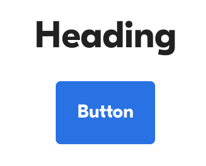
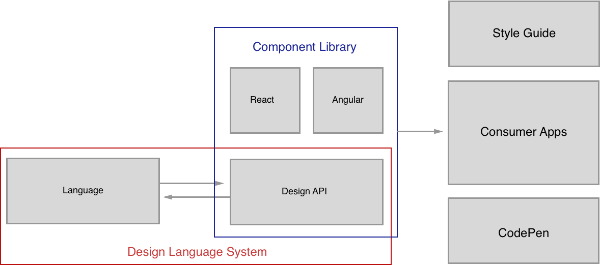

At the most complex levels of CSS development, front end software is developed by assembling reusable components, or design patterns. These are different than the design patterns created by the [Gang of Four](http://www.blackwasp.co.uk/gofpatterns.aspx). Rather, they are agreed upon User Interface building blocks that have been agreed upon by both design and engineering teams. At [Grubhub](https://www.grubhub.com), we create these patterns as bundles of CSS code that can then be easily exported and attached to HTML for assembly on external client apps.

Reflecting on the term API development, I've begun to conceptualize this collection of CSS bundles as _Design API_ development. If we consider a library like jQuery, for example, the usage is exactly the same. An engineer will import the library, look up the available methods, and then use those building blocks to create their own software. In the same way with our library, Mochi, we can import bits of the library and quickly spin up a grubhub themed web page.

API development has typically been used to describe Java or backend programming. But as we can see from this [quote](http://www.webopedia.com/TERM/A/API.html), the term is certainly applicable:

> “Application program interface (API) is a set of routines, protocols, and tools for building software applications. An API specifies how software components should interact. Additionally, APIs are used when programming graphical user interface (GUI) components. A good API makes it easier to develop a program by providing all the building blocks. A programmer then puts the blocks together.”

### How does our API work?

Our Design API is super simple, as are most front end style guides. We expose bundles of CSS styles that you can import into your application for consumption.

Let's take a closer look. I want to rapidly prototype a new page. To do that I need a heading and a button. I'll import buttons.scss and typography.scss. When I create my own software I will write:

```html
<h1>Heading</h1>
<button class="”s-btn”">Button</button>
```

I don't have to think about the code behind the button or the
heading. I just know that the desired outcome is going to be correct.
 You
could consider the exported classes as similar to setting a contract for a
typical server/client architecture. The classes would not change except for a
major revision, and those breaking changes would need to be communicated out to
all the parties involved. ### Terminology There are so many terms floating
around these days for the type of work we are doing. Front End Style Guide,
Living Style Guide, Pattern Library, Component Library... the list goes on and
one and the distinction between the terms gets pretty muddy. By labelling our
CSS classes Design APIs, the architecture becomes a lot more sensible. Consider
that the API layer is typically the “base” for a lot of the foundational data in
client applications. In this regard, our Design APIs fulfill that role by
providing the building blocks on which to develop more software. The diagram
below illustrates how the entire system works.
 Note carefully the
tightly coupled binding between design and development. We use language to
couple these two together. The shared language is what eases the communication
friction between teams and helps to reinforce the sort-of “contract” that is
involved with other API development. The design API acts as a base layer for our
component libraries. Keeping the API CSS-only allows use to create component
libraries in different Javascript frameworks as a layer on top of the API. We
can then bundle and export the component library for use in our flagship
applications (Grubhub, Seamless, AllMenus, and Grubhub for Restaurants), for
rapid prototyping in [CodePen Projects](https://codepen.io/pro/projects/), and
for documentation in our Living Style Guide.

### Future Use 
As you can see, we have a lot of future use for our Design APIs. Since we kept the code base CSS only, it is easily exportable into any application on the web. When Code Pen projects was launched, we were quickly able to produce rapid prototypes and provide working links to external parties. The uses are endless: quick demos for stakeholders, working prototypes that can be user tested, fleshed out ideas that design can hand off to developers. We also currently use the API in all sorts of different small scale applications: email templates, marketing modules, even our phone directory. Having a flat, CSS only system ensures its flexibility.
