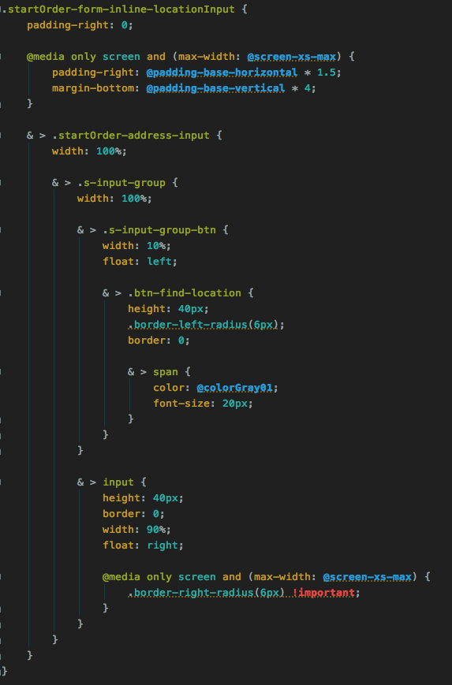
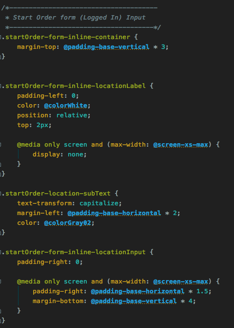

While I was just a student at University of Maryland, I learned early on that there were wildly different ways to code the same solution. The difference between good code and bad code wasn’t just achieving the desired output, but moreso a matter of style, eg. - things like elegance, simplicity, verboseness, and usability.

CSS is different than most languages. It's a simple, declarative language that tells a computer how to paint pixels on a page. In other words, you tell it to paint a button blue, and it will paint it blue.

Sounds pretty simple, right? But if it were that trivial, we wouldn’t be writing blog posts about it. So what’s the catch? The catch is _the cascade_. What most people easily forget is that styles are inherited from parent styles, and that there are specificity rules which further dictate the order that styles are applied. And as you might remember, it’s this lack of understanding that caused the [bloat in our application](http://www.snailbites.com/blog/wrangling-your-css-into-submission/).

Remember that classes in CSS were [originally intended to be reusable](https://en.wikipedia.org/wiki/Cascading_Style_Sheets#Use). Before stylesheets existed, we used to have to write the style for each element inline with that element. CSS was a way to avoid that, and instead target all similar elements at once with just a few lines of code. But in the real world, people don’t have time to intelligently design components like that. Real world teams are composed of developers who think and code differently, and are often in a rush.

As mentioned earlier, every developer has their own style. In most cases, we would want to encourage that style, but not in this case. Recall from our button example that CSS is a declarative language. There’s really only one way to paint a button blue. So we need to standardize that way, because as evidenced by our application, things can quickly get out of hand.

## Benchmark!

The first step in any major project is to benchmark. Remember that there is still a “science” aspect to computer science. And like any good scientist, you need to make sure that you have a baseline to reference, in order to see if your experiment yielded results. You’ll want to look closely at file size and page load time. If there are other factor motivating you to refactor your CSS, then take note of those too. Here’s a shot of where we were somewhere towards the beginning of our refactor.


It might also be helpful to screenshot some of the code, for reference. Think about it as taking a picture of an old messy basement before a remodel. You’ll want to remember how bad it is now when you’re basking in the glow of your brand new space.

Here’s a particularly painful section of code that I took note of before starting.



### Our code standards

Writing a code standards document is the single most important thing you will do in this entire process. [Our code standards document](https://github.com/snailbites/code-standards) is the result of studying several different types of CSS naming conventions. I took the best parts of lots of different systems and mashed it all together. Then, I simplified the hell out of it so we could start to use it right away. The main strategy can be summed up in the first few lines, and then the rest of the document contains rules to follow as best practices, ie. - indentation, overqualified selectors, etc…

If you’re like me and don’t ready anything, here’s a summary of the first few lines:

> Parent classes are written in camel case. Every child after that gets a dash. Modifiers take two dashes.

If you’re not like me and want the detail, read on.

First step is to think about your markup. Remember, as mentioned above, the whole point of CSS is to style your markup. So let’s think about the document for a sec. In a well formatted HTML document, you can clearly identify small blocks of code that serve different purposes on the page. In Angular, we break these down and bundle them with javascript to make what we call components. Whether or not you use a framework, you should be able to see how these separate out on your page. Here’s an example.

```html
<section>
    <header><h1>Title</h1></header>
    <div>
        <p>Stuff</p>
        <p>
            <a href="#"></a>
        </p>
    </div>
</section>
```

In the above, your “parent” class will be added to the `<section>`. Let’s call it `.info`.

Inside that, you have children. There is a `<header>` and a `<div>` at the first level. Let’s call those `.header` and `.body`. Since they are children, here’s where the simple rule comes into play. Add a dash and append the new classes onto the parent like so:

```html
<section class="info">
    <header class="info-header"><h1>Title</h1></header>
    <div class="info-body">
        <p>Stuff</p>
        <p>
            <a href="#"></a>
        </p>
    </div>
</section>

<style>
    .info {
    }
    .info-header {
    }
    .info-body {
    }
</style>
```

Now you have children inside the div. Those get another dash, like so.

What about the `<a>` and the `<h1>`? Here’s where you can make a decision. You can add a new class or you can simply use the child selector if there aren’t too many of them. Use your best judgement and remember the goals you were trying to achieve in the first place.

```css
.info {
}
.info-header {
}
.info-header-title {
}
.info-body {
}
.info-body > a {
}
```



You now have 3 levels of descendants in your one class. At the risk of classes becoming too long, this is about where it’s time to stop and start over recursively. The next element then becomes the “parent”, as before, and then the children within that get the first dash.

#### What about modifiers?

I mentioned earlier that modifiers take two dashes. What’s a modifier? Let’s say for instance, there were multiple body areas. One of them was an intro and one was regular. They both shared styles, but one was different. You could then create a class called `.component-body--intro`. Maybe the children inside get different treatment. If that’s the case, then the elements inside simply follow the dash rule. But the double dash stays and is always applied to body. It doesn’t go to the end of the entire class chain.

#### Why does this work?

As a good developer, you’re probably already poking holes into these rules. But let’s take a moment to explain why this works.

First, the naming convention is simple and easy enough to explain in one sentence. If your team is like ours, most of your time is spent wiring up the Angular component and maybe even getting the data into the proper format from the Java side. You don’t want or need to spend alot of time explaining something as trivial as CSS. You just need something that works so you can complete the last 5% of your story. With this method you can jump in right away and make positive changes that fit into the system, without having to understand the entire system.

Second, it allows you to once again see the casecade more clearly. With preprocessors so prevalent, it's easy to forget that styles are inherited by their parents. As a result, developers tend to ignore the cascade and rewrite rules and styles over and over again. You can get back to intelligently designing components and writing reusable, componentized code.

Third, it gets the team moving in the right direction quickly. All of your CSS from this point onward will at least be maintainable. You will already be cut in half. Even if the code itself is bad, the naming lends itself to refactoring. Take for example the code sample I screenshotted earlier and think about how long it would take to make changes to that chunk of code. Here’s a shot of some new code. Which would you rather maintain?



#### Where does this fall short?

Through the course of development, we realized some pitfalls with this method. The first and most glaring is the fact that all classes need to be tied to some sort of parent and can only be three or four levels deep. So what if an element is outside of that? What if we need to style something that cuts across multiple parents? There is no rule for that. You will end up writing multiple classes for this and your code will bloat. You’ll essentially be in the same place as you started.

Here’s where design consistency really comes into play. Think for a second why you would need to style things so differently? Why should one paragraph text differ that much from another that you would need to style things that uniquely?

The big answer to this question lies in UI patterns. We quickly found out that we couldn’t get away with just using these rules from the code side, but we also needed consistency and reusability along the design side. That’s where the pattern library and style guide comes into play. We’ll handle this in depth in a later post, but for now, its important to realize that as a developer, your refactoring can only do so much. If there is inconsistency across the design of your application, then you are bound to encounter bloat.

### What comes next?

Now that I had a good set of rules, I tossed these around to some of the other front end devs on the team and got their support. I shared the repo around and encouraged the team to make their own edits to get everyone involved.

As this happened, I refactored **ONE** particularly nasty page and submitted a PR. This allowed to the team to see the value of the refactor and buy into the process. After that PR was approved I was able to pull away some time to continue refactoring some of the worst performing pages by paint time, and start to refactor those. Other team members joined in and did the same. In a few weeks, we were in a place where the new code was up to standard and most of the old code was close enough to label satisfactory.

In summary, here’s the process I used for this step:

1. Benchmark
2. Make a document
3. Refactor ONE page
4. Get the team to buy in
