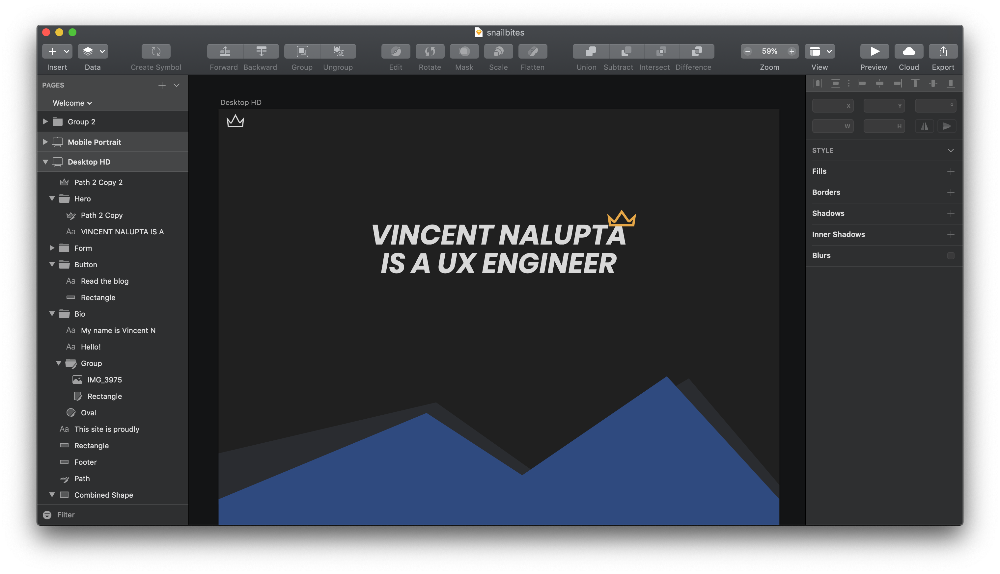
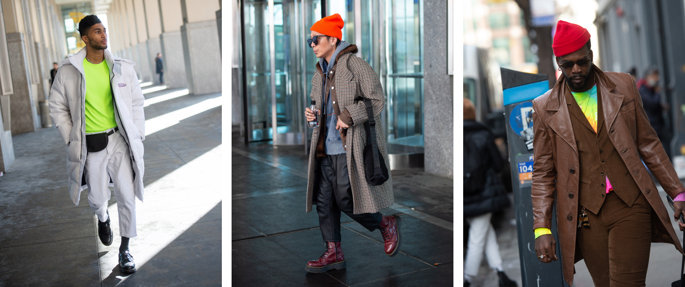

##### Welcome to the new site!

A few months ago I started playing with some code as a way to get familiar with some of the technologies that my team was going to start using at work: [Gatsby](https://www.gatsbyjs.org/) & [Styled Components](styled-components.com/). A couple things happened at the end of this summer that turned the whole "playing with code" into a full on redesign. First, we took a trip to Montreal at the end of the summer where I was so inspired by all of the great design I saw in the city. Second, I bought a [Wacom Tablet](https://www.amazon.com/Wacom-Wireless-Software-Pistachio-CTL4100WLE0/dp/B079J7DCXN/) totally on a whim because I've always wanted one. I took all of that pent up design inspiration from the trip and poured into this new toy that I just bought. The end result eventually became this new site.

#### Process

I haven't designed designed in a long time and honestly I just missed it. This was my chance to finally crank open Sketch and just do the thing that I enjoy without attaching a deadline or an outcome to it. I didn't start in code. I didn't make a design system. I know, I know. I work in design systems every single day so you would think I would start there because that's the right thing to do. But sometimes you just want to open Sketch and start, well, sketching. The cool thing that happened along the way was that in doing the design, a design system kind of opened up around me.

For instance, once I picked a typeface and started wireframing some content, I realized that I would need some headings and that I would have to make a decision about their sizing. I wanted some big, bold type and settled on [Poppins](https://fonts.google.com/specimen/Poppins). Then I headed over to [Type Scale](https://type-scale.com) to generate the sizes for me. Interestingly enough, you can generate typescales in a manner similar to musical moods. I chose [Major Third](https://en.wikipedia.org/wiki/Major_third) for no good reason other than it was the default choice. Styled components made it easy to apply that globally with [createGlobalStyle](https://www.styled-components.com/docs/api#createglobalstyle).

#### Sketching

There was a moment when I bought the pen tablet that I kind of thought to myself, Why did I buy this? I could've just borrowed one to see if I could even use it but typical Vince move I just went all in and bought a brand new one. Luckily for me it was love at first... touch? I probably could have just used a mouse for this but having a pen in your hand activates a different part of your brain. I just feel so creative in it.

Personally I've always liked blue. My desk is blue. Fun (weird) fact about me is that I've love watching Mountaineering documentaries on Netflix and Amazon. When I started sketching I wondered if I could throw some blue mountains in there and it just kind of worked as a teaser to more content without being really corny.

In the design I had two mountains skewed on top of each other. I actually laid those out as two different vector paths but when it came time to code them, fetching two separate images that did the same thing didn't make sense. So I just exported one of them as an SVG and [manipulated them to get the effect I wanted](https://github.com/snailbites/snailbites-gatsby/blob/master/src/components/mountainRange.js).

#### Colors

This summer I was really attracted to bold accent colors. I've been noticing in all sorts of places that artists of all different background are over-indexing on accents. To me this is a great thing! I'm seeing a ton of super monochromatic backdrops with a bright-ass accent popping out. Check out these looks from NYFW.

I really wanted to try something bold that would build on these blue mountains which I'd already fallen in love with. So I started experimenting with a color palette that would tie in all the inspiration from NYFW. Ultimately I landed on a mix of gradients and hard shapes that would pop some Nike-inspired Volt yellow every now and then.

    

    

    

    

    

    

You can check out the color values and view the palette [at Kuler](https://color.adobe.com/Redesign-color-theme-13425637).

#### Crowns

I got kind of into crowns after my son was born. His name means "Ruler of the people" in French. There's a play on words there because my name means "Conqueror" in Latin. You can kind of think about the idea of an old King going to conquer a bunch of territories and then leaving them for his son to rule. Naturally, when my son was born I got his name tattooed on my arm with a crown. My wedding ring is also a crown.

It's a given that crowns would be all over this site. The cool thing about SVGs is that you can manipulate their insides because they have a DOM that you can access just like HTML DOM. I wanted to provide some kind of open state for the navigation so I was messing around with transitioning the fill of the crown. I was super into this look because it reminded me of Max's crown from [Where the Wild Things Are](https://en.wikipedia.org/wiki/Where_the_Wild_Things_Are) - also quite sentimental to me since we read this book alot as a baby and we actually almost named him Max.

#### The Domain Name

I had no idea that when you don't renew your domain new it's likely gone forever. The hosting company will snatch up your domain and either try to sell it to someone else or [hold it at some absurd price](https://www.namepros.com/threads/held-hostage-by-huge-domains-advice.1023392/) to sell it back to you. There is a whole process behind it that is regulated internationally to avoid this type of behavior. But if you are ignorant, like me, then you would just let your $10 domain expire because anything that's $10 can easily be rebought. Not so.

I had bought snailbites dot com when I was 19. That was almost two decades ago! Two years ago, the second it expired, I saw it listed back up for $1795. I've been checking in every now and then to see if it would drop down. No luck. Last week, before I was about to launch this site, I literally begged them to give it back to me for cheap. I offered $500. They countered at $1695. We went on and on with me begging and them rejecting me until they settled on $1595 with a payment plan. Ya boy Vince over here was still offering \$500 😂

Distraught but hopeful, I put my creative thinking hat on and ended up buying this domain. It's a Spanish extension. When I registered, they asked for some ID without specifying exactly what number they needed. I did some research and some sites suggested a passport number or a valid driver's license. But which license and which country? When it came time to put that information, there were no specifics, just a field for a number. I wasn't comfortable using my passport so I put in _some_ number and lo and behold, my domain was registered with no problems.

#### Final Thoughts

I love the site I made. I was able to play with some things to help support my team as well as scratch my designer itch. I promise this time I'm going to write some more and now I have a home to do that. Don't be a stranger!
